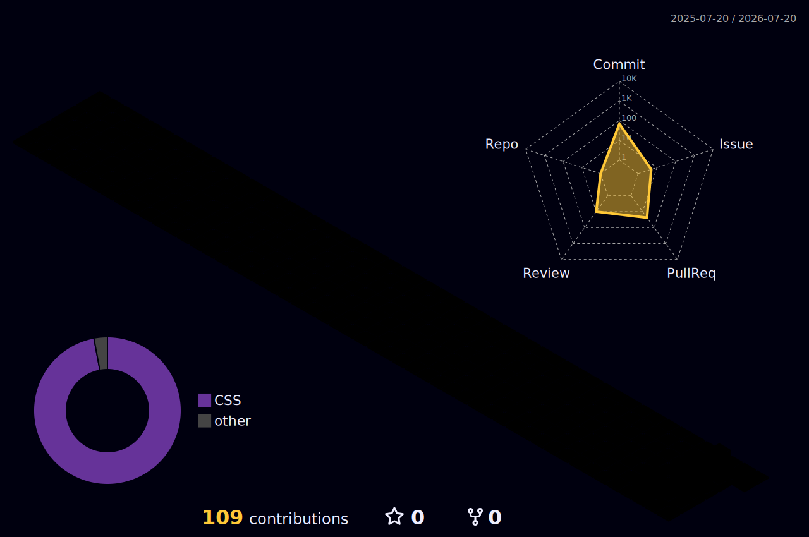

  

  I maintain <a href="https://github.com/Mantle-UI/mantle-ui"><strong>Mantle UI</strong></a> — a community-maintained React component library continued from PrimeReact v10.

  
  

 

## Meet the guardian

A small reminder to stay curious, ship thoughtfully, and keep the interface friendly.

## Building in the open

I care about thoughtful, composable UI systems and the little details that make developer tools feel good to use.

Right now, that means maintaining **Mantle UI**, improving its documentation and design system, and shipping practical progress one commit at a time.

 

<h2 align="center">The long game is made of small commits.</h2>

  

  Built in public. Improved in the details.

